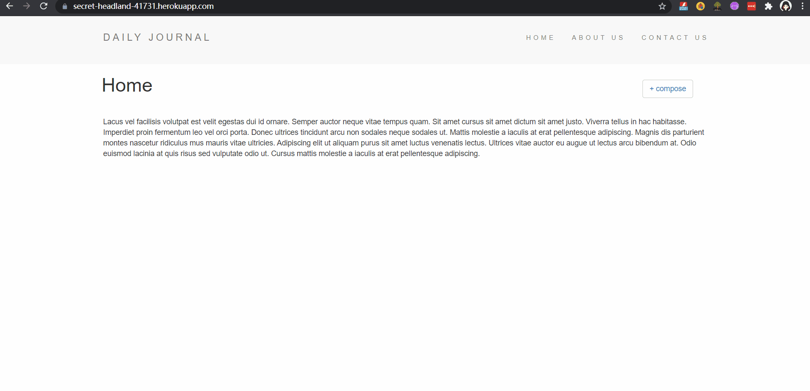

# Mongoose Daily Journal APP

## Check Out the APP: [Daily-Journal App](https://secret-headland-41731.herokuapp.com/)  

### The Express and Mongoose Deployed Daily Journal Web APP is consisted of three parts: the home page, the about page and the customized task List page. User first access the homepage where shows the date. New task items could be set up by clicking the "+" button and removed after the checkbox is checked.  The customized task lists can be accessed through input params such as "chores" or "work" into url path, every single type-in will generate a relative customized task list.  

## SKILLS:
#### It covers the topic of **_HTML, CSS, Js, Node.js, Express, EJS, MongoDB, Mongoose and Heroku**  

## HOW DOES IT WORK:
#### The project is deployed by Node.js and hosted on Heroku. The Daily-Journal app uses mongo Atlas as the database to store the input data.   The repo contains the backend file: app. js as the server file.    

## Display: 

